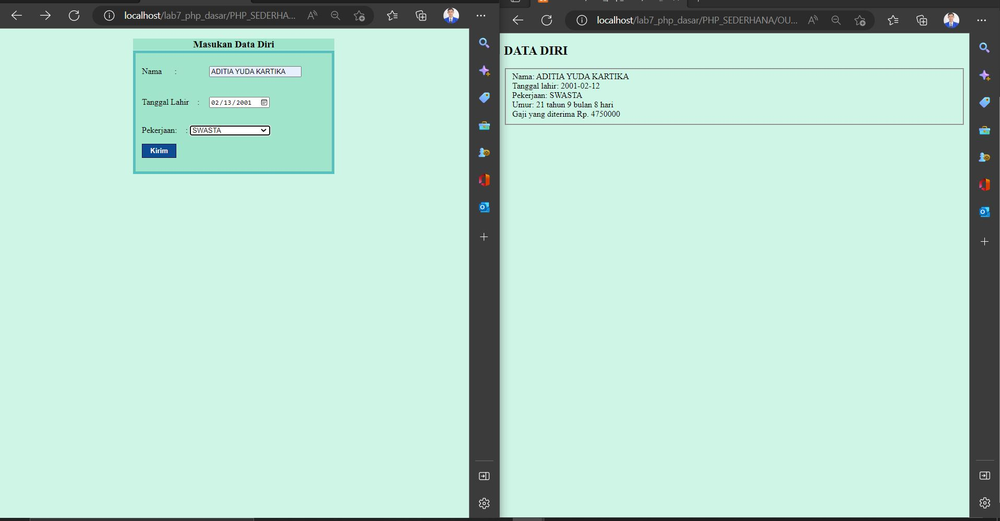

# Lab7web
Program PHP Sederhana dengan menggunakan Form inputan
## TUGAS PRAKTIKUM 7 LAB7WEB
* Buatlah program PHP sederhana dengan menggunakan form input yang menampilkan 
nama, tanggal lahir dan pekerjaan. Kemudian tampilkan outputnya dengan menghitung 
umur berdasarkan inputan tanggal lahir. Dan pilihan pekerjaan dengan gaji yang 
berbeda-beda sesuai pilihan pekerjaan.
* Berikut Adalah hasilnya:
- 
* Berikut adalah codingan untuk Form Inputan:
- 
* Berikut adalah codingan untuk Output/ Tampilan Hasil:
- 
## PRAKTIKUM 7
* PHP Dasar menampilkan "Hello Word", berikut adalah hasilnya:
- 
* Variable dalam php, berikut adalah hasilnya:
- 
* Predenifine dan GET, berikut adalah hasilnya:
- 
* Membuat Form inputan, berikut adalah hasilnya:
- 
* Operator, Kondisi if, switch, for, while, dowhile< berikut adalah hasilnya:
- 